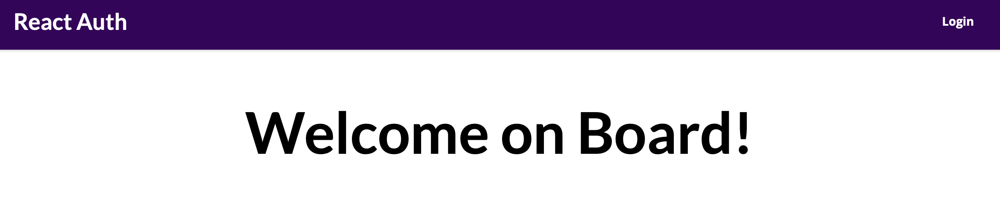
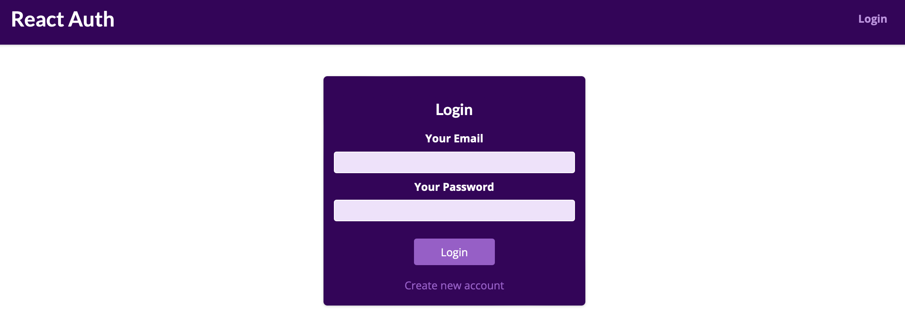
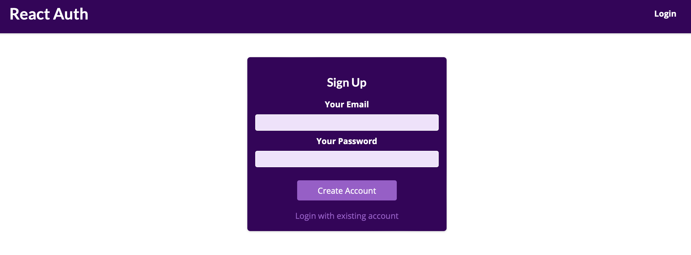
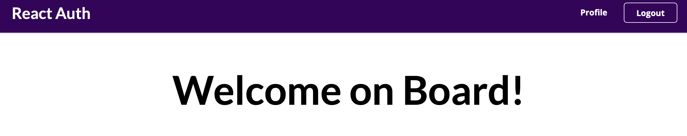
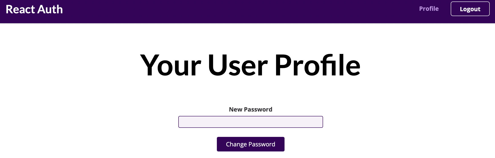

# reactAuth

## hooks
[useState, useEffect, useCallback -> ./src/store/auth-context.js](./src/store/auth-context.js)

## navigation
[Switch, Route, Redirect from 'react-router-dom' -> ./src/App.js](./src/App.js)\
[useHistory from 'react-router-dom' -> ./src/components/Auth/AuthForm.js](./src/components/Auth/AuthForm.js)\
[Link from 'react-router-dom' -> ./src/components/Layout/MainNavigation.js](./src/components/Layout/MainNavigation.js)

## contexts
[createContext -> ./src/store/auth-context.js](./src/store/auth-context.js)\
[useContext -> ./src/components/Auth/AuthForm.js](./src/components/Auth/AuthForm.js)\
[useContext -> ./src/App.js](./src/App.js)\
[Wrap with Provider -> ./src/index.js](./src/index.js)

## localStorage
[Persisting the user authentication status -> ./src/store/auth-context.js](./src/store/auth-context.js)

## images

  
  
  
  
  

